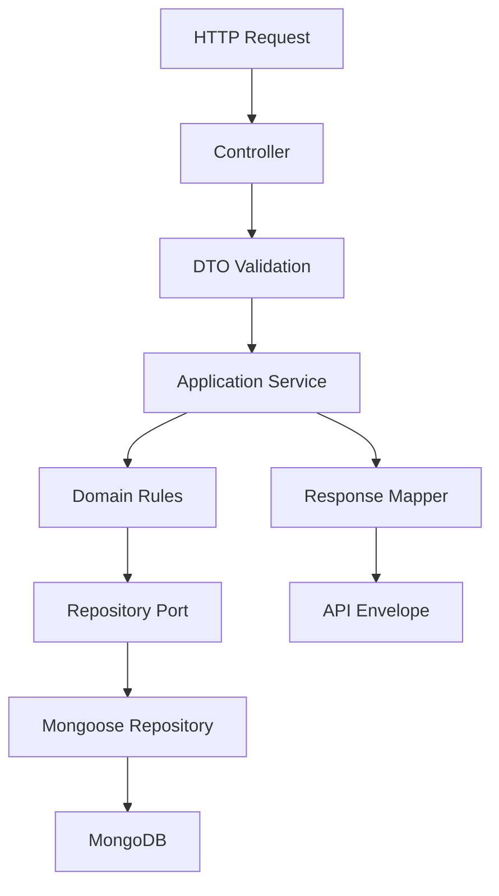
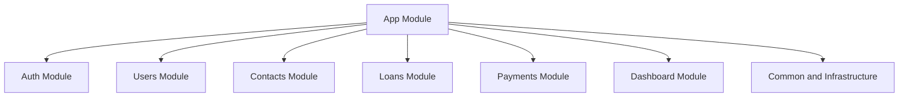

# MVP Backend Architecture Design

**Spec**: `.specs/project/PROJECT.md` + `.specs/features/glossary-assumptions/spec.md`
**Status**: Draft

---

## Architecture Overview

EmprestApp will start as a modular monolith in NestJS, organized by business capability and split internally by responsibility. The goal is to keep the MVP simple to operate while still isolating domain rules, transport contracts, and persistence concerns strongly enough to avoid rework when loans and payments become more complex.

The backend design follows this flow:



At MVP stage, this remains a single deployable NestJS API with feature modules and shared infrastructure:



---

## Code Reuse Analysis

### Existing Components to Leverage

This is a greenfield project. There is no existing application code to reuse yet.

### Planned Reuse Strategy

| Pattern | Planned Location | How to Use |
| --- | --- | --- |
| API response envelope | `src/common/http/` | Standardize `{ success, data, error }` across controllers |
| Base schema fields | `src/common/database/` | Reuse timestamps, ids, and ownership conventions |
| Auth guards and decorators | `src/modules/auth/` | Reuse authenticated user access rules across protected modules |
| Pagination and filter DTO patterns | `src/common/dto/` | Reuse for history, contacts, and dashboard list endpoints |
| Error mapping | `src/common/errors/` | Centralize domain-to-HTTP translation |

### Integration Points

| System | Integration Method |
| --- | --- |
| MongoDB | Mongoose schemas per module with module-owned repository adapters |
| JWT authentication | Access and refresh token flow via auth module and Nest guards |
| Password hashing | `bcrypt` in auth service only |
| Data export and deletion | Application services exposed through authenticated user endpoints |

---

## Components

### App Bootstrap

- **Purpose**: Compose global configuration, module registration, validation, and HTTP concerns.
- **Location**: `src/app.module.ts`, `src/main.ts`, `src/config/`
- **Interfaces**:
  - `bootstrap(): Promise<void>` - starts the API with global validation and security defaults
- **Dependencies**: Nest application factory, configuration module, validation pipe
- **Reuses**: standard Nest bootstrap pattern

### Auth Module

- **Purpose**: Manage registration, login, refresh, password hashing, and authenticated identity resolution.
- **Location**: `src/modules/auth/`
- **Interfaces**:
  - `register(input: RegisterUserInput): Promise<AuthSession>`
  - `login(input: LoginInput): Promise<AuthSession>`
  - `refresh(input: RefreshTokenInput): Promise<AuthSession>`
  - `revokeSession(userId: string, refreshTokenId: string): Promise<void>`
- **Dependencies**: user repository, JWT service, bcrypt, refresh token persistence
- **Reuses**: shared response envelope, auth guard/decorator patterns

### Users Module

- **Purpose**: Own user identity, profile metadata, and compliance operations such as data export and deletion.
- **Location**: `src/modules/users/`
- **Interfaces**:
  - `getProfile(userId: string): Promise<UserProfile>`
  - `exportData(userId: string): Promise<UserExportBundle>`
  - `deleteAccount(userId: string): Promise<void>`
- **Dependencies**: user repository, loan/contact/payment repositories for export and deletion workflows
- **Reuses**: auth identity context, repository port pattern

### Contacts Module

- **Purpose**: Manage the lender's people registry without coupling contact lifecycle to loan history.
- **Location**: `src/modules/contacts/`
- **Interfaces**:
  - `createContact(userId: string, input: CreateContactInput): Promise<Contact>`
  - `updateContact(userId: string, contactId: string, input: UpdateContactInput): Promise<Contact>`
  - `listContacts(userId: string, filter: ContactFilter): Promise<ContactListResult>`
  - `archiveContact(userId: string, contactId: string): Promise<void>`
- **Dependencies**: contact repository, validation layer
- **Reuses**: pagination/filter DTO patterns, ownership checks

### Loans Module

- **Purpose**: Own loan creation, updates, listing, details, lifecycle status, and balance computation orchestration.
- **Location**: `src/modules/loans/`
- **Interfaces**:
  - `createLoan(userId: string, input: CreateLoanInput): Promise<LoanDetails>`
  - `updateLoan(userId: string, loanId: string, input: UpdateLoanInput): Promise<LoanDetails>`
  - `listLoans(userId: string, filter: LoanFilter): Promise<LoanListResult>`
  - `getLoanDetails(userId: string, loanId: string): Promise<LoanDetails>`
  - `recalculateLoanState(loanId: string): Promise<LoanDerivedState>`
- **Dependencies**: loan repository, payment repository, financial calculation services
- **Reuses**: response mapping, date/value object patterns, status derivation rules

### Payments Module

- **Purpose**: Register payments and preserve immutable payment history for each loan.
- **Location**: `src/modules/payments/`
- **Interfaces**:
  - `registerPayment(userId: string, loanId: string, input: RegisterPaymentInput): Promise<PaymentReceipt>`
  - `listLoanPayments(userId: string, loanId: string, filter: PaymentFilter): Promise<PaymentListResult>`
- **Dependencies**: payment repository, loan repository, financial calculation services
- **Reuses**: ownership checks, response envelope, financial rule engine

### Dashboard Module

- **Purpose**: Produce lender-focused summaries from existing loan and payment state.
- **Location**: `src/modules/dashboard/`
- **Interfaces**:
  - `getSummary(userId: string): Promise<DashboardSummary>`
  - `getHistory(userId: string, filter: HistoryFilter): Promise<HistoryResult>`
- **Dependencies**: loan repository, payment repository, contact repository
- **Reuses**: filter DTO patterns and derived status rules from loans

### Domain Rule Components

- **Purpose**: Centralize deterministic financial calculations and loan status derivation outside controllers and repositories.
- **Location**: `src/modules/loans/domain/` and `src/modules/payments/domain/`
- **Interfaces**:
  - `calculateLoanBalance(loan: LoanAggregate, payments: Payment[]): LoanBalanceSnapshot`
  - `deriveLoanStatus(snapshot: LoanBalanceSnapshot, referenceDate: Date): LoanStatus`
  - `validatePaymentAgainstLoan(loan: LoanAggregate, input: RegisterPaymentInput): ValidationResult`
- **Dependencies**: finalized financial assumptions
- **Reuses**: pure TypeScript domain functions with unit-test focus

### Repository Ports and Adapters

- **Purpose**: Keep persistence isolated behind module-owned interfaces.
- **Location**: `src/modules/*/domain/ports/` and `src/modules/*/infrastructure/repositories/`
- **Interfaces**:
  - `findById(id: string): Promise<Entity | null>`
  - `save(entity: Entity): Promise<Entity>`
  - query methods per module use case
- **Dependencies**: Mongoose models and schema mapping
- **Reuses**: common base repository helpers for ownership and timestamp mapping

---

## Data Models

These models are architectural targets for later domain and persistence specs. They are not final persistence schemas yet.

### User

```typescript
interface User {
  id: string
  email: string
  passwordHash: string
  fullName: string
  status: 'active' | 'deleted'
  createdAt: Date
  updatedAt: Date
}
```

**Relationships**: owns contacts, loans, payments, and refresh sessions.

### Contact

```typescript
interface Contact {
  id: string
  userId: string
  fullName: string
  documentId?: string
  phone?: string
  notes?: string
  status: 'active' | 'archived'
  createdAt: Date
  updatedAt: Date
}
```

**Relationships**: belongs to one user and may be referenced by multiple loans.

### Loan

```typescript
interface Loan {
  id: string
  userId: string
  contactId?: string
  principalAmount: number
  interestModel: 'none' | 'simple' | 'compound'
  interestRate?: number
  startDate: Date
  dueDate: Date
  installmentPlan?: {
    count: number
    frequency: 'weekly' | 'monthly'
  }
  status: 'open' | 'paid' | 'overdue'
  createdAt: Date
  updatedAt: Date
}
```

**Relationships**: belongs to one user, may reference one contact, aggregates many payments.

### Payment

```typescript
interface Payment {
  id: string
  userId: string
  loanId: string
  amount: number
  paidAt: Date
  method?: 'cash' | 'bank_transfer' | 'pix' | 'other'
  note?: string
  createdAt: Date
}
```

**Relationships**: belongs to one loan and one user; must remain immutable after creation except for administrative correction flows if later specified.

### Refresh Session

```typescript
interface RefreshSession {
  id: string
  userId: string
  tokenHash: string
  expiresAt: Date
  revokedAt?: Date
  createdAt: Date
}
```

**Relationships**: belongs to one user and supports auth session rotation.

---

## Error Handling Strategy

| Error Scenario | Handling | User Impact |
| --- | --- | --- |
| Validation failure on DTO input | Return `400` with structured error payload inside the standard envelope | User sees which field is invalid |
| Authentication failure | Return `401` with generic auth error message | User must login again or refresh token |
| Accessing another user's resource | Return `404` or `403` based on endpoint exposure decision; default to resource hiding for direct ids | Prevents data leakage |
| Loan or payment business-rule violation | Return `422` with domain-specific error code | User can correct financial input |
| Resource not found | Return `404` in standard envelope | User understands entity does not exist |
| Unexpected infrastructure failure | Return `500` and log internal details only | User sees safe generic failure |

---

## Tech Decisions

| Decision | Choice | Rationale |
| --- | --- | --- |
| System shape | Modular monolith | Matches MVP simplicity while preserving module boundaries |
| Layering | Controller -> DTO -> service -> domain -> repository | Keeps HTTP, business logic, and persistence separate |
| Persistence isolation | Repository ports plus Mongoose adapters | Allows domain rules to remain persistence-agnostic |
| Financial rules placement | Pure domain services/functions | Deterministic calculations are easier to test and reuse |
| Immutable payment history | Payments are append-only records | Preserves auditability and avoids silent balance drift |
| Response shape | Global success/data/error envelope | Matches project requirement and standardizes clients |
| Compliance hooks | Data export and deletion live in users module | Keeps LGPD workflows explicit and user-owned |

---

## Task Readiness and Remaining Gaps

The following information is sufficient to create implementation tasks for project bootstrap, auth foundations, module scaffolding, shared infrastructure, and testing setup.

The following items still block detailed loan/payment tasks from being safe:

| Gap | Why it blocks tasks | Proposed next artifact |
| --- | --- | --- |
| Payment allocation order | Affects balance math and payment validation | Domain spec or assumptions register |
| Interest accrual timing | Affects total due and overdue behavior | Domain calculation spec |
| Installment semantics | Affects loan schema, status logic, and history views | Domain lifecycle spec |
| Overpayment handling | Affects payment validation and ledger behavior | Domain rule spec |
| Resource hiding rule for unauthorized ids | Affects consistent API contract behavior | API contract spec |

Until those are resolved, task creation should split into:

1. Unblocked foundation tasks: app bootstrap, auth, shared infrastructure, response envelope, testing scaffold, and module skeletons.
2. Blocked domain tasks: loans, payments, dashboard financial summaries, and final data model decisions.
